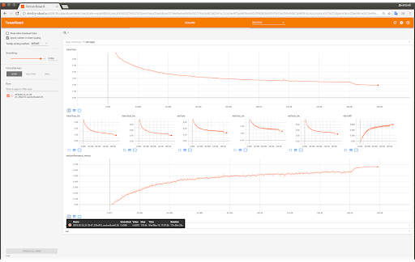
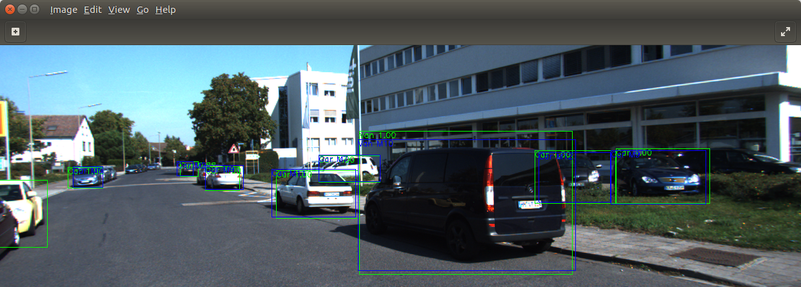

# SDD-inspired detection framework for Kitti

[](https://bettercodehub.com/)

## 2D object bounding box detection is solved using an implementation of SSD detector.

### Dataset
The whole Kitti dataset of 6000 images is split into two parts: 95% for train and 5% for validation. Augmentation of random vertical and horizontal shift was applied to tackle the problem of cars being visually at the same positions within the frame

### Neural network
Work resolution of 256x512 is used as input to the neural network. Resnet-34 is used as a backbone, VGG-like additional layers are stacked on top of it. Three branches are taken from the backbone, another three - from additional layers. Branch configuration is as follows [channels, height, width]:
 - [128, 32, 64]
 - [256, 16, 32]
 - [512, 8, 16]
 - [512, 4, 8]
 - [256, 2, 4]
 - [256, 1, 2]

Imagenet-pretrained model is taken from Pytorch’es samples, weights were not frozen.
Anchors are generated in a way that in one cell there are 6 anchors: 3 aspect ratios and 2 scales.
Model is trained for 1000 epochs at batch size 32 and base learning rate 0.01 with warm-up of 10 epochs. Online hard example mining (OHEM) 1:3 is used to address foreground-background imbalance. Training took 18 hours on 2 1080ti in multi-gpu mode.
The primary advantage of the provided framework and the trainer class for PyTorch is its modular structure. For example, all shapes of regression/classification branches are derived automatically from input resolution and backbone’s branch shapes. Also, calculation of a target for a loss from annotation is encapsulated into the main class SingleShotDetector (file detection_models.py). Number of classes is set via the labelmap and all the parameters are derived from this single source. I have tried to eliminate any possible code or parameter duplication, which is there is many open source implementations of SSD.

### Training results
Accuracy metric is implemented according to Kitti specification: minimal IoU overlap 0.7 for cars, 0.5 for other classes. The model’s target metric of Car average precision (AP) was chosen. Achieved AP for car is 0.65 which is quite lower than SotA 91% on Kitti.


|Class | AP    |
|------|-------|
| Car  | 0.654 |
| Van  | 0.677 |
| Truck  | 0.862 |
| Pedestrian  | 0.427 |
| Person_sitting  | 0.219 |
| Cyclist  | 0.509 |
| Tram  | 0.697 |
| Misc  | 0.583 |
| mAP  | 0.579 |

Training loss curve shows that the training almost converges. Longer training should yield about 5% higher AP.



### Testing
A sample image with detection results is as follows. Blue are ground truth boxes, green are detected boxes.



### How to run

```
python detect2d.py
```
To generate detected bounding boxes run
```
python detect2d.py --validate
```
Resulting images with overlays are saved to `runs/resnet34_pretrained/detection_val_dump` folder.

## TODO list
- [x] More fast-learning backbone to train from scratch
- [ ] Add FPN
- [x] Experiment managing
- [ ] Local configuration (.template)
- [ ] Profile
- [ ] Rewrite to albumentations or cv2
- [x] Gradients and weights to tensorboard 
